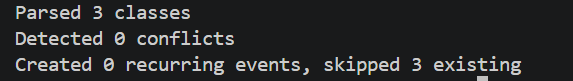
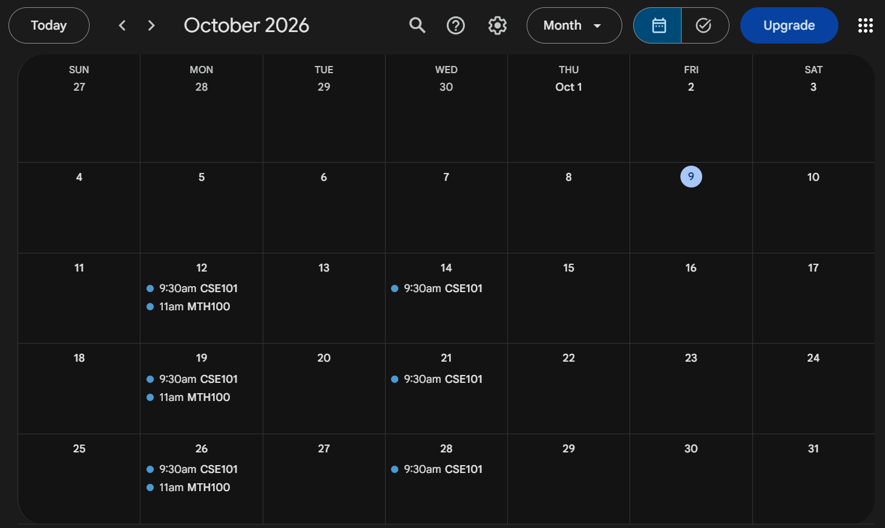

# Timetable Sync

Convert a class timetable (CSV) into recurring Google Calendar events, safely and repeatably.

## What it does

- Parses a timetable CSV into structured `ClassSession` objects
- Detects overlapping classes and stops before touching your calendar
- Creates one weekly recurring event per class, bounded by the semester dates
- Safe to re-run: deterministic event IDs mean it never creates duplicates

## Demo

Running the tool (the classes already exist from an earlier run, so they are skipped rather than duplicated):



The result in Google Calendar:



## How it works

```
timetable.csv -> ClassSession objects -> conflict check -> recurring events (RRULE) -> Google Calendar
```

**Parsing.** `parser.py` reads the CSV with `csv.DictReader` and turns each row into a `ClassSession` (defined in `models.py`), so the rest of the code works with structured data instead of raw dictionary keys.

**Conflict detection.** Two sessions conflict if they fall on the same day and their time ranges overlap, which is true when `start1 < end2 and start2 < end1`. Using strict inequality means back-to-back classes (one ends at 11:00, the next starts at 11:00) are correctly not flagged. `find_conflicts` checks every unique pair using `itertools.combinations`, and the sync refuses to run if any conflict is found.

**Recurrence.** A class is not a single event, it is "every Monday from 9:30 to 11:00 until the semester ends". Each class becomes one Google Calendar event with a weekly `RRULE` and an `UNTIL` date. The first occurrence is calculated from the day name using `weekday()` and modular arithmetic, so a class on "Wednesday" starts on the first Wednesday on or after the semester start date.

**Avoiding duplicates.** My first version created every event again on each run. The fix was to give each event a deterministic ID: a SHA-1 hash of the course, day, start time and end time. Google rejects an insert whose ID already exists with an HTTP 409 error, and the program catches that and counts the class as skipped. That makes the whole sync idempotent: running it twice produces the same calendar as running it once.

**Authentication.** The tool uses Google's OAuth flow with the Calendar API. The Google quickstart requests read-only access, so I had to widen the scope to full calendar access before events could be created. Credentials and the login token are kept out of version control through `.gitignore`.

## Setup

1. Install dependencies:
```
   python -m pip install -r requirements.txt
```
2. In Google Cloud Console, create a project, enable the **Google Calendar API**, configure the OAuth consent screen (add yourself as a test user), and create an **OAuth client ID** of type **Desktop app**. Download it as `credentials.json` into the project folder. See [Google's Python quickstart](https://developers.google.com/calendar/api/quickstart/python).
3. Edit `timetable.csv` with your classes.
4. Set the semester start and end dates in the `__main__` block of `calendar_sync.py`.
5. Run:
```
   python calendar_sync.py
```
   A browser window opens the first time so you can approve access.

## Timetable format

```
course,day,start_time,end_time,room
CSE101,Monday,09:30,11:00,C201
```

- `day` is the full English day name (`Monday` ... `Sunday`)
- Times are 24-hour `HH:MM`, zero-padded (`09:30`, not `9:30`), because conflict checks compare the time strings directly

## Project structure

| File | Purpose |
|---|---|
| `models.py` | `ClassSession` data model |
| `parser.py` | Loads the CSV into `ClassSession` objects |
| `conflicts.py` | Overlap detection |
| `calendar_sync.py` | Google auth, recurrence logic, event creation, entry point |
| `timetable.csv` | Sample timetable |

## Limitations and future work

- Semester dates are set in code rather than passed in as arguments
- Time zone is hardcoded to `Asia/Kolkata`
- No update detection yet: if a class changes room or time, the old event is not modified in place. A changed time produces a new event ID, so it would create a new event next to the old one
- Holidays are not excluded from the recurrence
- Google keeps deleted event IDs reserved, so re-syncing a class you deleted by hand is skipped rather than recreated
- Only the CSV input format is supported; the parser is separate from the sync logic so other formats could be added